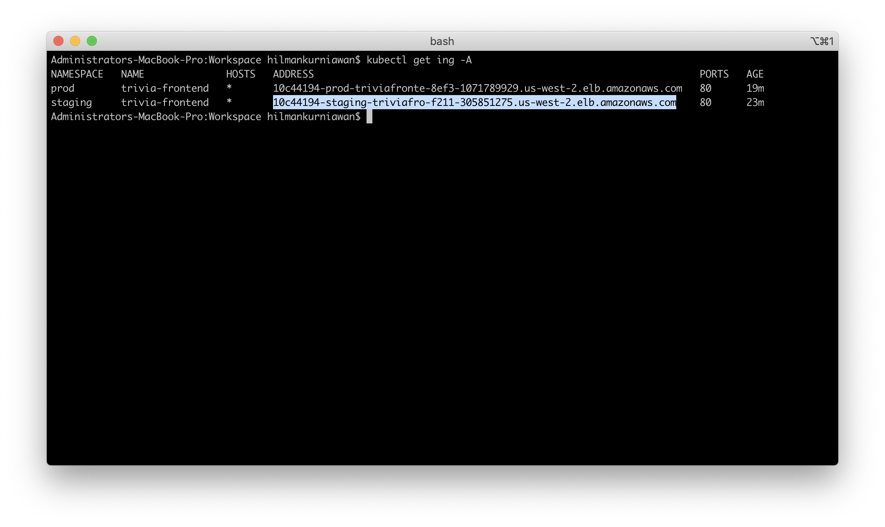
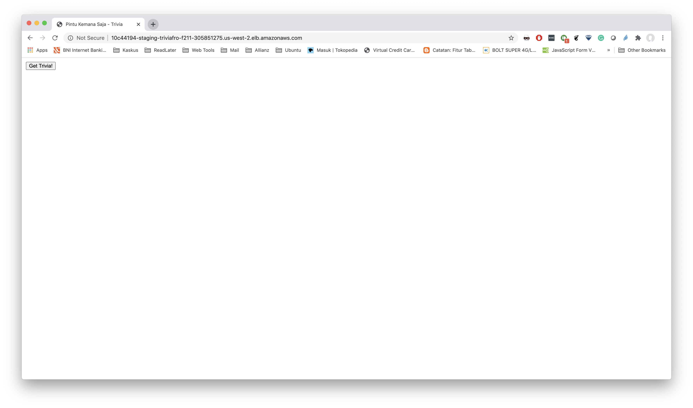
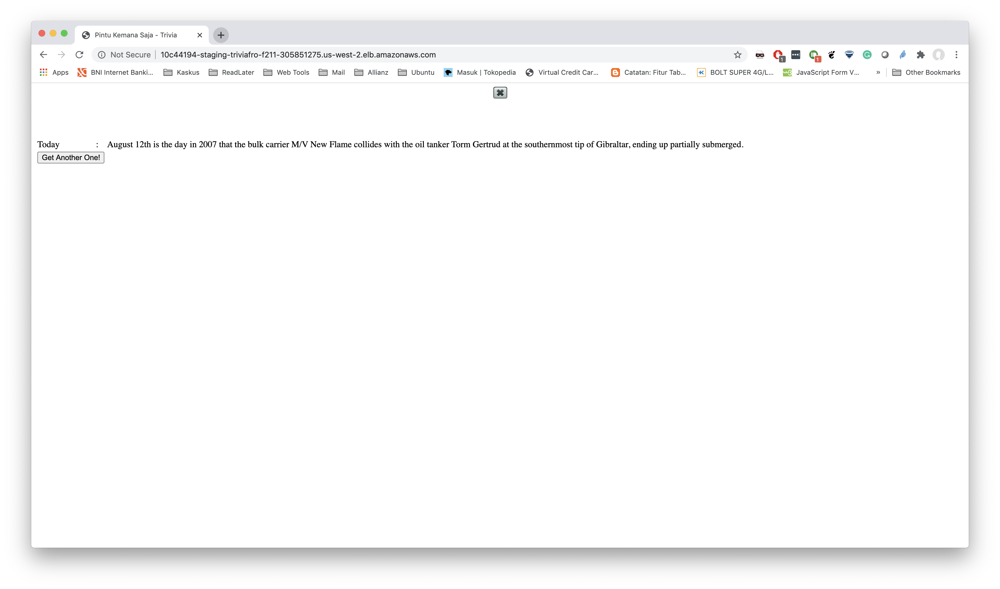

# pintu-kemana-saja

## Deploy EKS Cluster on AWS with AWS ALB Ingress Controller
### Deploy EKS Cluster with Terraform
```bash
git clone https://github.com/terraform-aws-modules/terraform-aws-eks.git
cd terraform-aws-eks/examples/basic
terraform init
terraform apply
```
### Update Kube Config
```bash
# check eks cluster name
aws eks list-clusters --region us-west-2
# update kubeconfig
aws eks update-kubeconfig --region --name $EKS_CLUSTER_NAME --region us-west-2
```
### Install AWS ALB Ingress Controller
1. Create IAM Policy
   ```bash
   # create iam policy
   aws iam create-policy \
     --policy-name ALBIngressControllerIAMPolicy \
     --policy-document file://alb-ingress-controller/alb-ingress-policy-iam-policy.json
   ```
2. Create IAM User with policy that created from #1
3. Note down Access key ID and Secret access key
4. Modify alb-ingress-controller/alb-ingress-controller.yaml file and fill the value for AWS_ACCESS_KEY_ID and AWS_SECRET_ACCESS_KEY with value from #3
5. Modify container arguments (cluster-name) for alb-ingress-controller with correct cluster name
6. apply rbac-role.yaml
   ```bash
   kubectl apply -f alb-ingress-controller/rbac-role.yaml 
   ```
7. apply alb-ingress-controller.yaml
   ```bash
   kubectl apply -f alb-ingress-controller/alb-ingress-controller.yaml
   ```
8. Make sure there's alb-ingress-controller deployment in kube-system namespace
   ```bash
   kubectl get deploy -n kube-system
   ```

## Build Docker Images
```bash
bash build-image.sh [SERVICE_NAME]
```
Example:
```
bash build-image.sh trivia-frontend
```

## Deploy Backend and Frontend to EKS
```bash
bash deploy.sh [SERVICE_NAME] [ENV]
```

Example:
```bash
# deploy app on staging
bash deploy.sh trivia-frontend staging
bash deploy.sh trivia-backend staging

# deploy app on prod
bash deploy.sh trivia-frontend prod
bash deploy.sh trivia-backend prod
```

## Access Frontend from Public URL
1. Check ingress with kubectl
   ```bash
   kubectl get ing -A
   ```
   
2. Open the address in browser
   
   
